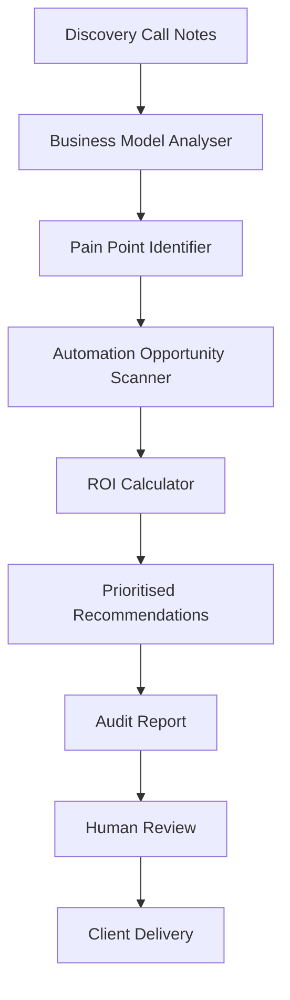

# Business Audit Agent Pattern

**For:** Business assessment and audit agents (e.g., CONN)
**Purpose:** Analyse a business's operations, identify AI/automation opportunities, quantify ROI
**Pattern type:** Diagnostic agent — triggered after discovery call, outputs assessment report

---

## Architecture



## Core Processors

| Processor | Responsibility |
|-----------|---------------|
| `call_notes_reader` | Reads structured notes from discovery call (Supabase) |
| `business_model_analyser` | Understands what the business does, how it makes money |
| `pain_point_identifier` | Maps pain points from call to operational categories |
| `opportunity_scanner` | Identifies automation opportunities per pain point |
| `roi_calculator` | Quantifies savings/time saved per opportunity |
| `report_builder` | Constructs 3-phase audit report |
| `prioritiser` | Ranks opportunities by ROI + feasibility |

## Required Skills

| Skill | Purpose |
|-------|---------|
| `audit-framework-skill` | 3-phase audit structure (Discovery → Mapping → Presentation) |
| `business-analysis-skill` | How to understand a business model quickly |
| `roi-calculation-skill` | How to calculate realistic ROI for automation |
| `automation-knowledge-skill` | What processes can be automated in what industries |
| `report-writing-skill` | How to write a client-facing audit report |

## SOUL Template Additions

```markdown
## Audit Process

- Triggered by: discovery call completion (CALLIE → CONN)
- Input: call notes from Supabase
- Output: 3-phase audit report (Discovery → Mapping → Presentation)
- Every recommendation must have: description, estimated time savings, ROI estimate
- Recommendations ranked by: ROI × feasibility
- Report must be reviewed by Dusk before delivery to client
```

## Audit Report Structure (3-Phase)

### Phase 1: Discovery
- Business overview (size, industry, role)
- Current state assessment
- Key pain points expressed by owner

### Phase 2: Mapping
- Current workflows mapped
- Bottlenecks and manual processes identified
- AI/automation opportunity categories

### Phase 3: Presentation
- Prioritised recommendations table
- Each recommendation: description, time saved, cost to implement, ROI
- Next steps

## Common Pitfalls

1. **Inflated ROI estimates** — numbers that look good but aren't realistic
2. **Too many recommendations** — overwhelming client with a list of 20 things
3. **Vague descriptions** — "automate marketing" instead of specific workflows
4. **No follow-up path** — audit delivered but no clear next step
5. **Skipping feasibility** — recommending things that can't actually be built

## Success Criteria

- [ ] Report follows 3-phase structure exactly
- [ ] Every recommendation has: description, time savings, ROI estimate
- [ ] Top 5 recommendations are actionable and buildable
- [ ] Dusk approves report before client delivery
- [ ] First 3 audits reviewed by Dusk

## ICP Integration

Audit agents work with ICP:
- Property Managers / Strata (primary)
- Tradies — Electricians, Plumbers, HVAC, Builders (secondary)
- Industry-specific pain points must be pre-loaded via skill files

## Extension Points

- `build_estimator` — after audit, estimate cost/time to build recommended automations
- `competitor_comparison` — benchmark against similar businesses
- `followup_tracker` — track which clients implemented recommendations
