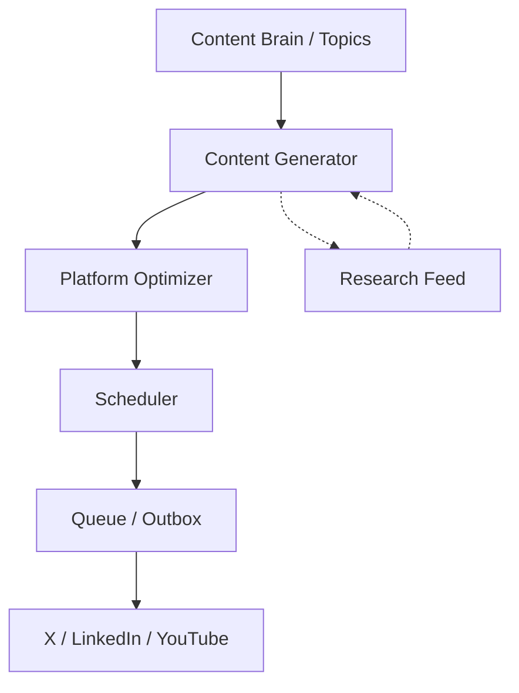

# Content Agent Pattern

**For:** Content intelligence agents (e.g., PRISM, Maya)
**Purpose:** Automated content generation, scheduling, and platform optimization
**Pattern type:** Pipeline agent — triggered by cron or on-demand

---

## Architecture



## Core Processors

| Processor | Responsibility |
|-----------|---------------|
| `topic_picker` | Selects next topic from content_brain (weighted by recency + priority) |
| `content_generator` | Generates content based on topic + platform skill |
| `platform_optimizer` | Applies platform-specific rules (X algo, LinkedIn algo, etc.) |
| `scheduler` | Determines optimal posting time using algorithm |
| `queue_manager` | Manages outbox/queue, handles retries |
| `analytics_tracker` | Logs engagement metrics back to content_brain |

## Required Skills

| Skill | Purpose |
|-------|---------|
| `platform-algorithm-skill` | Platform-specific rules (X, LinkedIn, YouTube) |
| `content-hook-skill` | Hook formulas, headline patterns |
| `tone-voice-skill` | Voice direction, style guide |
| `topic-selection-skill` | How to pick topics from the content brain |

## SOUL Template Additions

```markdown
## Content Process

- Topics come from [content_brain / Dusk / cron trigger]
- Never post without applying platform algorithm
- Text-first for X, media-optional for LinkedIn/YouTube
- All content goes through: generate → optimize → schedule → queue
- Engagement metrics fed back into topic priority
```

## Common Pitfalls

1. **Posting without algorithm application** — content optimized for one platform fails on another
2. **No flooding control** — posting too frequently tanks reach
3. **No topic recency weighting** — old topics get reshuffled without new angles
4. **No approval gate** — automated posting without human review first
5. **No engagement loop** — not tracking what works and adjusting

## Success Criteria

- [ ] Platform algorithm applied to every post before publishing
- [ ] Flooding rule enforced (X: 2hr minimum between posts)
- [ ] Content approved by human before first 10 posts
- [ ] Analytics tracked and fed back into topic selection
- [ ] Queue handles failures gracefully (retry, skip, alert)

## LLM Notes

Content agents benefit from: strong instruction following, creative generation, platform knowledge. Default: MiniMax-M2.7 for generation speed + cost, Claude for quality review if needed.

## Extension Points

- `media_generator` — add image/video generation (future)
- `thread_breaker` — split long-form into thread format
- `comment_responder` — auto-respond to comments (X premium feature)
