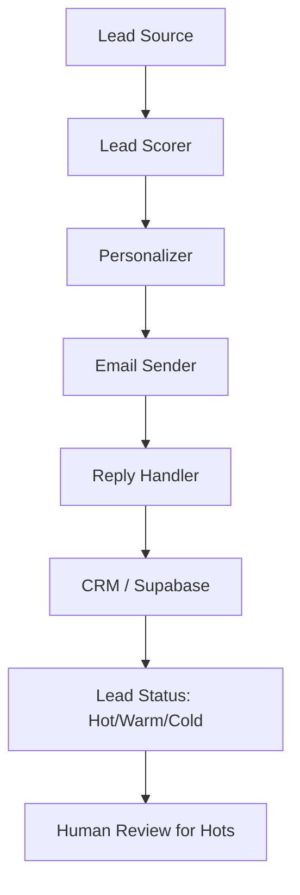

# Outreach Agent Pattern

**For:** Outreach, cold email, and lead follow-up agents (e.g., Karma, LOZZZ)
**Purpose:** Find leads, personalize outreach, manage campaigns, handle replies
**Pattern type:** Funnel agent — batch processing + real-time reply handling

---

## Architecture



## Core Processors

| Processor | Responsibility |
|-----------|---------------|
| `lead_finder` | Discovers leads from target lists or web search |
| `lead_scorer` | Qualifies leads (ICP match, intent signals) |
| `personalizer` | Injects company/contact data into email template |
| `email_sender` | Sends via SMTP/Gmail, handles bounces |
| `reply_classifier` | Categorizes replies (interested, not interested, callback booked, bounce) |
| `followup_manager` | Tracks sequence steps, triggers follow-ups |
| `crm_writer` | Writes lead status + interaction history to database |

## Required Skills

| Skill | Purpose |
|-------|---------|
| `cold-email-skill` | Email templates, subject line formulas, timing rules |
| `lead-scoring-skill` | ICP criteria, intent signal definitions |
| `personalization-skill` | Data injection patterns, company research |
| `reply-handling-skill` | Reply classification + action routing |

## SOUL Template Additions

```markdown
## Outreach Rules

- Never email the same lead twice (track in CRM)
- Personalization must be real — no generic placeholders
- Reply classification is mandatory — every reply gets a category
- Hot leads → human review immediately
- Sequence follows: initial → follow-up 1 → follow-up 2 → disconnect
- Bounce = remove from list immediately
```

## Common Pitfalls

1. **Duplicate emails** — no deduplication, same person emailed multiple times
2. **Fake personalization** — "[Name]" filled in but nothing real about the company
3. **No reply handling** — replies sit in inbox unclassified
4. **No sequence management** — follow-ups fire regardless of reply
5. **No bounce handling** — bounced emails retried or ignored rather than removed

## Success Criteria

- [ ] Zero duplicate emails to same lead
- [ ] Every reply classified within 1 hour
- [ ] Hot leads flagged for human review same day
- [ ] Bounce rate < 3%
- [ ] Dusk reviews first 10 emails before fully live
- [ ] Sequence enforced (no early/late follow-ups)

## ICP Definition (Required Input)

Before outreach starts, must define:
- Target geography
- Target industry
- Company size
- Role/title filters
- Intent signals (visited pricing page, downloaded content, etc.)

## Extension Points

- `linkedin_outreach` — LinkedIn connection requests + messages
- `phone_dialer` — cold call integration
- `warm_lead_tracker` — tracks inbound intent signals
