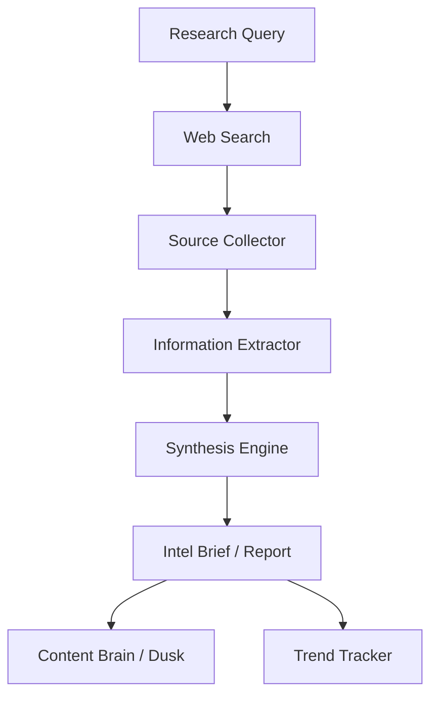

# Research Agent Pattern

**For:** Research and intelligence agents (e.g., CLARKE, Harold)
**Purpose:** Systematic research on topics, competitive intelligence, market analysis
**Pattern type:** Batch agent — triggered by cron or on-demand, outputs to content brain

---

## Architecture



## Core Processors

| Processor | Responsibility |
|-----------|---------------|
| `search_planner` | Breaks research query into sub-queries |
| `web_searcher` | Executes searches via DuckDuckGo/other |
| `source_collector` | Gathers relevant pages, extracts key info |
| `info_extractor` | Pulls facts, figures, claims from sources |
| `synthesizer` | Combines extracted info into coherent brief |
| `trend_detector` | Identifies patterns across multiple searches |
| `brief_writer` | Formats output as structured intel brief |

## Required Skills

| Skill | Purpose |
|-------|---------|
| `research-methodology-skill` | How to structure research, source quality hierarchy |
| `search-query-skill` | How to write effective search queries |
| `source-evaluation-skill` | How to assess source credibility |
| `brief-writing-skill` | How to format intelligence briefs |

## SOUL Template Additions

```markdown
## Research Process

- Triggered by: cron (daily AI/SaaS news) or on-demand query
- Research must: cite sources, distinguish facts from opinions, note confidence level
- Output goes to: content_brain for PRISM, or direct to Dusk
- Quality bar: minimum 3 credible sources, no single-source claims
- Scope creep guard: define research scope upfront, flag if query expands
```

## Common Pitfalls

1. **Single-source reliance** — building a claim on one source
2. **No confidence scoring** — treating weak signals as facts
3. **Scope creep** — research expands beyond original query
4. **Outdated information** — citing sources that are no longer current
5. **No actionable output** — research is interesting but not useful

## Success Criteria

- [ ] Every claim backed by at least 3 sources
- [ ] Confidence level assigned to each major finding
- [ ] Sources cited with URLs/dates
- [ ] Research scope defined and respected
- [ ] Output is actionable (not just interesting)

## LLM Notes

Research agents need: strong factual accuracy, good synthesis, broad world knowledge. Default: Claude for deep research, MiniMax-M2.7 for speed. Can use parallel searches to speed up.

## Research Cron Pattern (Daily)

```
6:00 AM — Run research: AI agent news + SaaS tool releases
7:00 AM — Intel brief generated
7:05 AM — Delivered to content_brain (PRISM topic queue)
```

## Extension Points

- `competitive_tracker` — ongoing monitoring of competitors
- `trend_alert` — notify when significant developments occur
- `source_monitor` — track specific sites for updates
