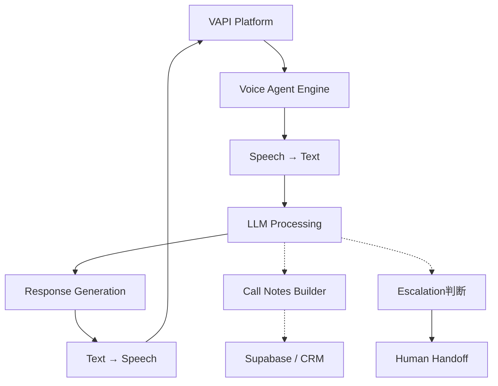

# Voice Agent Pattern

**For:** VAPI telephony agents (e.g., CALLIE)
**Purpose:** Conduct voice conversations, capture structured notes, qualify prospects
**Pattern type:** Real-time agent — connects to VAPI, processes calls, stores results

---

## Architecture



## Core Processors

| Processor | Responsibility |
|-----------|---------------|
| `call_initiator` | Connects to VAPI, starts call session |
| `transcript_processor` | Processes real-time transcript chunks |
| `intent_classifier` | Identifies caller intent mid-call |
| `response_generator` | Generates LLM response in real-time |
| `notes_builder` | Constructs structured call notes from transcript |
| `readiness_scorer` | Calculates lead readiness score |
| `escalation_checker` | Detects hostile/ complex calls → human handoff |
| `supabase_writer` | Writes call data to Supabase |

## Required Skills

| Skill | Purpose |
|-------|---------|
| `vapi-integration-skill` | VAPI SDK usage, call flow setup |
| `discovery-question-skill` | Question framework for discovery phase |
| `objection-handling-skill` | Common objections + responses |
| `escalation-skill` | When to hand off to human |
| `notes-template-skill` | How to structure call notes |

## SOUL Template Additions

```markdown
## Voice Process

- Calls initiated by: inbound click-to-call (no cold calls)
- Every call: discovery → qualification → close/next steps
- Notes saved to Supabase immediately after call ends
- Escalation triggers: hostile caller, legal question, pricing negotiation
- Never promise pricing — always "I'll have someone follow up"
```

## Common Pitfalls

1. **No transcript capture** — call happens but nothing is recorded
2. **Late escalation** — waiting too long to hand off, caller gets frustrated
3. **No notes structure** — transcript dumped but not summarized
4. **Readiness score inflation** — scoring everyone as hot to seem effective
5. **Missed follow-up** — call ends well but no follow-up scheduled

## Success Criteria

- [ ] Call connects and completes without technical failure
- [ ] Notes saved to Supabase within 5 minutes of call end
- [ ] Readiness score calculated (tested against Dusk's judgment)
- [ ] Escalation fires correctly for hostile callers
- [ ] Dusk reviews first 3 calls before fully live

## VAPI-Specific Notes

- Use Web SDK for browser-based calls (no phone number needed for inbound)
- Assistant ID + Bearer token stored in vault, not in code
- Webhook endpoint: receives call events → triggers processor
- Call recording: only if legally compliant (one-party consent in Australia)

## Extension Points

- `appointment_booker` — books calendar slot during call
- `sms_followup` — sends SMS after call
- `call_recording` — full transcript + audio storage
